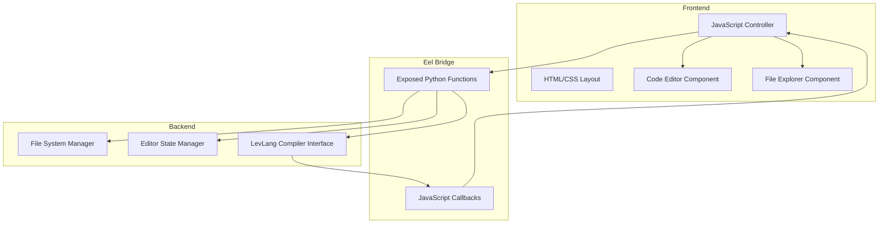

# LevCode Design Document

## Overview

LevCode is a cross-platform desktop application built with Python and Eel that provides an IDE-like environment for editing and running LevLang source files. The architecture follows a clear separation between the Python backend (file operations, compilation) and the HTML/CSS/JavaScript frontend (user interface, editor). Communication between layers occurs through Eel's exposed function mechanism.

The application prioritizes simplicity, local operation, and a clean user experience. All file operations and compilation processes run locally without external dependencies or cloud services.

## Architecture

### High-Level Architecture



### Technology Stack

- **Backend**: Python 3.8+
  - Eel (frontend-backend bridge)
  - Standard library modules: os, pathlib, json
  
- **Frontend**: Vanilla HTML/CSS/JavaScript
  - No external frameworks (React, Vue, etc.)
  - CodeMirror or Monaco Editor for code editing (lightweight integration)
  
- **Packaging**: PyInstaller for creating standalone executables

### Directory Structure

```
levcode/
├── backend/
│   ├── __init__.py
│   ├── main.py              # Entry point, Eel initialization
│   ├── file_manager.py      # File system operations
│   ├── compiler.py          # LevLang compilation interface
│   └── config.py            # Application configuration
├── frontend/
│   ├── index.html           # Main application layout
│   ├── css/
│   │   └── style.css        # Application styles
│   └── js/
│       ├── app.js           # Main application controller
│       ├── editor.js        # Editor component logic
│       └── file_explorer.js # File explorer component logic
├── requirements.txt         # Python dependencies
├── build.py                 # PyInstaller build script
└── README.md               # Setup and packaging instructions
```

## Components and Interfaces

### Backend Components

#### 1. Main Application (main.py)

**Responsibilities:**
- Initialize Eel with frontend directory
- Start the application window
- Configure window properties (size, title)
- Handle application lifecycle

**Key Functions:**
```python
def start_app():
    """Initialize and launch the LevCode application"""
    
def get_initial_directory():
    """Return the user's home directory or last opened directory"""
```

#### 2. File Manager (file_manager.py)

**Responsibilities:**
- Read directory contents
- Load file contents
- Save file contents
- Validate file paths and permissions

**Exposed Functions:**
```python
@eel.expose
def list_directory(path: str) -> dict:
    """
    Returns directory contents with files and subdirectories
    Returns: {
        'success': bool,
        'items': [{'name': str, 'type': 'file'|'dir', 'path': str}],
        'error': str (optional)
    }
    """

@eel.expose
def load_file(file_path: str) -> dict:
    """
    Loads file contents from disk
    Returns: {
        'success': bool,
        'content': str,
        'path': str,
        'error': str (optional)
    }
    """

@eel.expose
def save_file(file_path: str, content: str) -> dict:
    """
    Saves content to specified file path
    Returns: {
        'success': bool,
        'path': str,
        'error': str (optional)
    }
    """
```

#### 3. Compiler Interface (compiler.py)

**Responsibilities:**
- Execute LevLang compilation process
- Capture compilation output
- Handle compilation errors
- Manage subprocess execution

**Exposed Functions:**
```python
@eel.expose
def compile_and_run(file_path: str) -> dict:
    """
    Compiles LevLang file and executes resulting Pygame code
    Returns: {
        'success': bool,
        'output': str,
        'error': str (optional)
    }
    """
```

### Frontend Components

#### 1. Application Controller (app.js)

**Responsibilities:**
- Initialize application state
- Coordinate between editor and file explorer
- Handle global keyboard shortcuts
- Manage application-level events

**Key Functions:**
```javascript
function initializeApp() {
    // Initialize components and load initial directory
}

function handleSaveShortcut(event) {
    // Ctrl+S / Cmd+S handler
}

function showNotification(message, type) {
    // Display user feedback messages
}
```

#### 2. File Explorer Component (file_explorer.js)

**Responsibilities:**
- Display directory tree structure
- Handle directory expansion/collapse
- Trigger file loading on selection
- Maintain explorer state

**Key Functions:**
```javascript
async function loadDirectory(path) {
    // Call backend to get directory contents
    // Render directory tree
}

function handleFileClick(filePath) {
    // Load file into editor
}

function handleDirectoryClick(dirPath) {
    // Toggle directory expansion
}

function renderFileTree(items, parentElement) {
    // Recursively render directory structure
}
```

#### 3. Editor Component (editor.js)

**Responsibilities:**
- Initialize code editor instance
- Track file state (modified, saved)
- Handle editor events
- Provide save functionality

**Key Functions:**
```javascript
function initializeEditor() {
    // Create editor instance with configuration
}

function loadFileContent(filePath, content) {
    // Load content into editor and update state
}

async function saveCurrentFile() {
    // Save editor content to backend
}

function markAsModified() {
    // Update UI to show unsaved changes
}

function markAsSaved() {
    // Update UI to show saved state
}
```

## Data Models

### File System Item
```javascript
{
    name: string,        // File or directory name
    type: 'file' | 'dir', // Item type
    path: string,        // Absolute path
    extension: string    // File extension (files only)
}
```

### Editor State
```javascript
{
    currentFile: string | null,  // Path of currently open file
    content: string,             // Current editor content
    isModified: boolean,         // Has unsaved changes
    isSaving: boolean           // Save operation in progress
}
```

### Application Response
```javascript
{
    success: boolean,    // Operation succeeded
    data: any,          // Response data (varies by operation)
    error: string       // Error message (if success is false)
}
```

## Error Handling

### Backend Error Handling

**File Operations:**
- Catch `FileNotFoundError`, `PermissionError`, `IOError`
- Return structured error responses with user-friendly messages
- Log errors for debugging purposes

**Compilation Errors:**
- Capture stderr from compilation subprocess
- Parse and format error messages
- Return compilation output even on failure

**Error Response Format:**
```python
{
    'success': False,
    'error': 'User-friendly error message',
    'details': 'Technical details for debugging'
}
```

### Frontend Error Handling

**Network/Communication Errors:**
- Handle Eel connection failures gracefully
- Display user-friendly error notifications
- Provide retry mechanisms where appropriate

**User Input Validation:**
- Validate file paths before sending to backend
- Check for empty content before saving
- Confirm destructive operations

**Error Display:**
- Use non-intrusive notification system
- Provide clear, actionable error messages
- Include relevant context (file name, operation type)

## User Interface Design

### Layout Structure

```
┌─────────────────────────────────────────────────────┐
│  LevCode                                    [_][□][X]│
├──────────┬──────────────────────────────────────────┤
│          │  [Save] [Run]                            │
│  Files   ├──────────────────────────────────────────┤
│          │                                           │
│  📁 src  │                                           │
│    📄 a  │         Editor Pane                       │
│    📄 b  │                                           │
│  📁 test │                                           │
│          │                                           │
│          │                                           │
└──────────┴──────────────────────────────────────────┘
```

### Visual Design Principles

1. **Flat Design**: No shadows, gradients, or 3D effects
2. **Minimal Chrome**: Remove unnecessary borders and decorations
3. **Clear Hierarchy**: Use size and spacing to establish importance
4. **Monochrome Base**: Use neutral colors with subtle accents
5. **Consistent Spacing**: 8px grid system for alignment

### Color Scheme (Example)

```css
--bg-primary: #1e1e1e;      /* Main background */
--bg-secondary: #252526;    /* Sidebar background */
--text-primary: #cccccc;    /* Main text */
--text-secondary: #858585;  /* Secondary text */
--accent: #007acc;          /* Interactive elements */
--border: #3e3e3e;          /* Subtle borders */
```

## Testing Strategy

### Backend Testing

**Unit Tests:**
- Test file_manager functions with mock file system
- Test compiler interface with mock subprocess calls
- Verify error handling for edge cases

**Integration Tests:**
- Test Eel function exposure and calling
- Verify end-to-end file operations
- Test compilation workflow

### Frontend Testing

**Manual Testing:**
- Verify UI responsiveness across window sizes
- Test keyboard shortcuts
- Verify file explorer navigation
- Test editor functionality (typing, saving, loading)

**Cross-Platform Testing:**
- Test on Windows 10/11
- Test on macOS (latest and previous version)
- Test on Ubuntu Linux

### Packaging Testing

**Build Verification:**
- Verify PyInstaller builds complete without errors
- Test standalone executable launches correctly
- Verify all assets are bundled properly
- Test on clean systems without Python installed

## Packaging and Distribution

### PyInstaller Configuration

**Build Script (build.py):**
```python
# Simplified example
import PyInstaller.__main__

PyInstaller.__main__.run([
    'backend/main.py',
    '--name=LevCode',
    '--windowed',
    '--add-data=frontend:frontend',
    '--onefile',
    '--icon=icon.ico'
])
```

**Platform-Specific Considerations:**

- **Windows**: Use `--windowed` to hide console, include .ico icon
- **macOS**: Create .app bundle, sign for distribution
- **Linux**: Create AppImage or .deb package for easy distribution

### Distribution Checklist

1. Test executable on target platform
2. Verify all dependencies are bundled
3. Test on system without Python installed
4. Verify file operations work correctly
5. Test compilation functionality
6. Create installation instructions
7. Package with README and license

## Implementation Notes

### Editor Choice

**Recommendation: CodeMirror 6**
- Lightweight and performant
- Easy integration with vanilla JavaScript
- Good syntax highlighting support
- Minimal dependencies

**Alternative: Textarea with syntax highlighting**
- Even lighter weight
- Use Prism.js or highlight.js for syntax coloring
- Simpler but less feature-rich

### File Explorer Implementation

**Approach:**
- Load directory contents on demand (lazy loading)
- Cache expanded directory states
- Use recursive rendering for nested structures
- Filter to show only .lvl files and directories

### Compilation Process

**Placeholder Implementation:**
- Initially, create a stub function that simulates compilation
- Return mock output for testing
- Replace with actual LevLang compiler integration later
- Use subprocess.run() for actual compiler execution

### Cross-Platform Considerations

**Path Handling:**
- Use pathlib.Path for all path operations
- Normalize paths before sending to frontend
- Handle Windows drive letters correctly

**File Encoding:**
- Default to UTF-8 for all file operations
- Handle encoding errors gracefully
- Preserve line endings (CRLF vs LF)

## Security Considerations

1. **Path Traversal**: Validate all file paths to prevent directory traversal attacks
2. **File Permissions**: Check read/write permissions before operations
3. **Subprocess Safety**: Sanitize inputs to compilation subprocess
4. **Resource Limits**: Prevent loading extremely large files that could crash the app

## Performance Considerations

1. **Lazy Loading**: Load directory contents only when needed
2. **Debouncing**: Debounce save operations to prevent excessive disk writes
3. **Editor Performance**: Use virtual scrolling for large files
4. **Startup Time**: Minimize initialization overhead for fast startup
