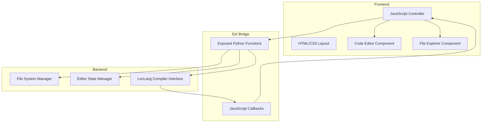

# LevCode Design Document

## Overview

LevCode is a cross-platform desktop application built with Python and Eel that provides an IDE-like environment for editing and running LevLang source files. The architecture follows a clear separation between the Python backend (file operations, compilation) and the HTML/CSS/JavaScript frontend (user interface, editor). Communication between layers occurs through Eel's exposed function mechanism.

The application prioritizes simplicity, local operation, and a clean user experience. All file operations and compilation processes run locally without external dependencies or cloud services.

## Architecture

### High-Level Architecture



### Technology Stack

- **Backend**: Python 3.8+
  - Eel (frontend-backend bridge)
  - Standard library modules: os, pathlib, json
  
- **Frontend**: Vanilla HTML/CSS/JavaScript
  - No external frameworks (React, Vue, etc.)
  - CodeMirror or Monaco Editor for code editing (lightweight integration)
  
- **Packaging**: PyInstaller for creating standalone executables

### Directory Structure

```
levcode/
├── backend/
│   ├── __init__.py
│   ├── main.py              # Entry point, Eel initialization
│   ├── file_manager.py      # File system operations
│   ├── compiler.py          # LevLang compilation interface
│   └── config.py            # Application configuration
├── frontend/
│   ├── index.html           # Main application layout
│   ├── css/
│   │   └── style.css        # Application styles
│   └── js/
│       ├── app.js           # Main application controller
│       ├── editor.js        # Editor component logic
│       └── file_explorer.js # File explorer component logic
├── requirements.txt         # Python dependencies
├── build.py                 # PyInstaller build script
└── README.md               # Setup and packaging instructions
```

## Components and Interfaces

### Backend Components

#### 1. Main Application (main.py)

**Responsibilities:**
- Initialize Eel with frontend directory
- Start the application window
- Configure window properties (size, title)
- Handle application lifecycle

**Key Functions:**
```python
def start_app():
    """Initialize and launch the LevCode application"""
    
def get_initial_directory():
    """Return the user's home directory or last opened directory"""
```

#### 2. File Manager (file_manager.py)

**Responsibilities:**
- Read directory contents
- Load file contents
- Save file contents
- Validate file paths and permissions

**Exposed Functions:**
```python
@eel.expose
def list_directory(path: str) -> dict:
    """
    Returns directory contents with files and subdirectories
    Returns: {
        'success': bool,
        'items': [{'name': str, 'type': 'file'|'dir', 'path': str}],
        'error': str (optional)
    }
    """

@eel.expose
def load_file(file_path: str) -> dict:
    """
    Loads file contents from disk
    Returns: {
        'success': bool,
        'content': str,
        'path': str,
        'error': str (optional)
    }
    """

@eel.expose
def save_file(file_path: str, content: str) -> dict:
    """
    Saves content to specified file path
    Returns: {
        'success': bool,
        'path': str,
        'error': str (optional)
    }
    """
```

#### 3. Compiler Interface (compiler.py)

**Responsibilities:**
- Execute LevLang compilation process
- Capture compilation output
- Handle compilation errors
- Manage subprocess execution

**Exposed Functions:**
```python
@eel.expose
def compile_and_run(file_path: str) -> dict:
    """
    Compiles LevLang file and executes resulting Pygame code
    Returns: {
        'success': bool,
        'output': str,
        'error': str (optional)
    }
    """
```

### Frontend Components

#### 1. Application Controller (app.js)

**Responsibilities:**
- Initialize application state
- Coordinate between editor and file explorer
- Handle global keyboard shortcuts
- Manage application-level events
- Manage tab state for multiple open files

**Key Functions:**
```javascript
function initializeApp() {
    // Initialize components and load initial directory
}

function handleSaveShortcut(event) {
    // Ctrl+S / Cmd+S handler
}

function showNotification(message, type) {
    // Display user feedback messages
}

function openTab(filePath) {
    // Open file in new tab or switch to existing tab
}

function closeTab(filePath) {
    // Close tab and handle unsaved changes
}

function updateStatusBar(lineNum, colNum, encoding, fileType) {
    // Update status bar information
}
```

#### 2. File Explorer Component (file_explorer.js)

**Responsibilities:**
- Display directory tree structure with icons
- Handle directory expansion/collapse with chevron indicators
- Trigger file loading on selection
- Maintain explorer state (expanded folders, selected file)
- Show hover states for better UX

**Key Functions:**
```javascript
async function loadDirectory(path) {
    // Call backend to get directory contents
    // Render directory tree with icons
}

function handleFileClick(filePath) {
    // Load file into editor and open tab
    // Update selection state
}

function handleDirectoryClick(dirPath) {
    // Toggle directory expansion
    // Update chevron icon (▶ ↔ ▼)
}

function renderFileTree(items, parentElement, level = 0) {
    // Recursively render directory structure
    // Add proper indentation based on level
    // Add folder/file icons and chevrons
}

function updateSelection(filePath) {
    // Highlight selected file
    // Remove previous selection
}
```

#### 3. Editor Component (editor.js)

**Responsibilities:**
- Initialize code editor instance
- Track file state (modified, saved)
- Handle editor events (typing, cursor movement)
- Provide save functionality
- Update status bar with cursor position

**Key Functions:**
```javascript
function initializeEditor() {
    // Create editor instance with configuration
    // Set up event listeners for cursor movement
}

function loadFileContent(filePath, content) {
    // Load content into editor and update state
    // Update tab title
}

async function saveCurrentFile() {
    // Save editor content to backend
    // Update tab state (remove modified indicator)
}

function markAsModified() {
    // Update tab to show unsaved changes (dot indicator)
}

function markAsSaved() {
    // Update tab to show saved state
}

function onCursorMove(lineNum, colNum) {
    // Update status bar with cursor position
}

function getEditorState() {
    // Return current line, column, content
}
```

#### 4. Tab Manager Component (tabs.js)

**Responsibilities:**
- Manage multiple open file tabs
- Track active tab
- Handle tab switching
- Handle tab closing with unsaved changes warning
- Render tab bar UI

**Key Functions:**
```javascript
function createTab(filePath, fileName) {
    // Create new tab element
    // Add to tab bar
    // Set as active tab
}

function switchTab(filePath) {
    // Switch to specified tab
    // Load file content in editor
    // Update active state
}

function closeTab(filePath, force = false) {
    // Check for unsaved changes
    // Prompt user if needed
    // Remove tab and switch to adjacent tab
}

function updateTabState(filePath, isModified) {
    // Update tab visual state (modified indicator)
}

function getActiveTab() {
    // Return currently active tab info
}

function getAllTabs() {
    // Return array of all open tabs
}
```

## Data Models

### File System Item
```javascript
{
    name: string,        // File or directory name
    type: 'file' | 'dir', // Item type
    path: string,        // Absolute path
    extension: string,   // File extension (files only)
    isExpanded: boolean  // Directory expansion state (dirs only)
}
```

### Tab State
```javascript
{
    filePath: string,      // Absolute path to file
    fileName: string,      // Display name
    content: string,       // File content
    isModified: boolean,   // Has unsaved changes
    isActive: boolean,     // Currently active tab
    cursorLine: number,    // Current cursor line
    cursorColumn: number   // Current cursor column
}
```

### Editor State
```javascript
{
    tabs: Tab[],                 // Array of open tabs
    activeTabPath: string | null, // Path of active tab
    isSaving: boolean            // Save operation in progress
}
```

### File Explorer State
```javascript
{
    rootPath: string,            // Root directory path
    expandedDirs: Set<string>,   // Set of expanded directory paths
    selectedFile: string | null  // Currently selected file path
}
```

### Application Response
```javascript
{
    success: boolean,    // Operation succeeded
    data: any,          // Response data (varies by operation)
    error: string       // Error message (if success is false)
}
```

## Error Handling

### Backend Error Handling

**File Operations:**
- Catch `FileNotFoundError`, `PermissionError`, `IOError`
- Return structured error responses with user-friendly messages
- Log errors for debugging purposes

**Compilation Errors:**
- Capture stderr from compilation subprocess
- Parse and format error messages
- Return compilation output even on failure

**Error Response Format:**
```python
{
    'success': False,
    'error': 'User-friendly error message',
    'details': 'Technical details for debugging'
}
```

### Frontend Error Handling

**Network/Communication Errors:**
- Handle Eel connection failures gracefully
- Display user-friendly error notifications
- Provide retry mechanisms where appropriate

**User Input Validation:**
- Validate file paths before sending to backend
- Check for empty content before saving
- Confirm destructive operations

**Error Display:**
- Use non-intrusive notification system
- Provide clear, actionable error messages
- Include relevant context (file name, operation type)

## User Interface Design

### Layout Structure

```
┌─────────────────────────────────────────────────────────────┐
│ ● ● ●  LevCode                                      [_][□][X]│
├──────────┬──────────────────────────────────────────────────┤
│          │  📄 CategoryRestController.kt              ×     │
│  Files   ├──────────────────────────────────────────────────┤
│          │  [Save] [Run]                                    │
│  ▼ 📁 src├──────────────────────────────────────────────────┤
│    ▼ 📁 m│                                                   │
│      📄 C│         Editor Pane                               │
│      📄 C│         (Code content with syntax highlighting)   │
│      📄 E│                                                   │
│    ▶ 📁 d│                                                   │
│  ▶ 📁 tes│                                                   │
│          │                                                   │
├──────────┴──────────────────────────────────────────────────┤
│ Ln 17, Col 42  UTF-8  Kotlin                                │
└─────────────────────────────────────────────────────────────┘
```

### Visual Design Principles

1. **IDE-Inspired Design**: Professional appearance similar to IntelliJ IDEA, VS Code
2. **Dark Theme**: High contrast dark theme for reduced eye strain
3. **Clear Hierarchy**: Use size, spacing, and color to establish visual importance
4. **Icon System**: Consistent folder and file icons with expand/collapse indicators
5. **Consistent Spacing**: 8px grid system for alignment and padding
6. **Subtle Interactions**: Hover states and smooth transitions for better UX

### Color Scheme

```css
/* Dark Theme - High Contrast */
--bg-primary: #1e1e1e;        /* Main editor background */
--bg-secondary: #252526;      /* Sidebar background */
--bg-tertiary: #2d2d30;       /* Hover states */
--bg-titlebar: #323233;       /* Title bar background */
--text-primary: #cccccc;      /* Main text */
--text-secondary: #858585;    /* Secondary text */
--text-muted: #6a6a6a;        /* Muted text */
--accent-blue: #007acc;       /* Primary accent */
--accent-blue-hover: #1a8cd8; /* Accent hover state */
--border: #3e3e3e;            /* Subtle borders */
--border-light: #454545;      /* Lighter borders */
--selection: #264f78;         /* Selection background */
--error: #f48771;             /* Error states */
--success: #89d185;           /* Success states */
--warning: #dcdcaa;           /* Warning states */
```

### Component Specifications

#### Title Bar
- Height: 32px
- Background: `--bg-titlebar`
- Contains: Traffic lights (macOS) or window controls (Windows/Linux), app title
- Font: 13px, medium weight
- Non-draggable buttons, draggable background

#### Tab Bar
- Height: 36px
- Background: `--bg-secondary`
- Tab styling: Rounded top corners, active tab has `--bg-primary` background
- Close button (×) on each tab
- Maximum visible tabs: 10 (scroll for more)

#### Toolbar
- Height: 40px
- Background: `--bg-secondary`
- Button styling: Flat with hover states, 28px height
- Spacing: 8px between buttons

#### File Explorer
- Width: 240px (resizable)
- Background: `--bg-secondary`
- Item height: 24px
- Indent per level: 16px
- Icons: 
  - Collapsed folder: ▶ 📁
  - Expanded folder: ▼ 📁
  - File: 📄
- Hover state: `--bg-tertiary`
- Selected state: `--accent-blue`

#### Status Bar
- Height: 24px
- Background: `--bg-titlebar`
- Font: 12px
- Sections: Line/Col info, encoding, file type
- Spacing: 16px between sections

## Testing Strategy

### Backend Testing

**Unit Tests:**
- Test file_manager functions with mock file system
- Test compiler interface with mock subprocess calls
- Verify error handling for edge cases

**Integration Tests:**
- Test Eel function exposure and calling
- Verify end-to-end file operations
- Test compilation workflow

### Frontend Testing

**Manual Testing:**
- Verify UI responsiveness across window sizes
- Test keyboard shortcuts
- Verify file explorer navigation
- Test editor functionality (typing, saving, loading)

**Cross-Platform Testing:**
- Test on Windows 10/11
- Test on macOS (latest and previous version)
- Test on Ubuntu Linux

### Packaging Testing

**Build Verification:**
- Verify PyInstaller builds complete without errors
- Test standalone executable launches correctly
- Verify all assets are bundled properly
- Test on clean systems without Python installed

## Packaging and Distribution

### PyInstaller Configuration

**Build Script (build.py):**
```python
# Simplified example
import PyInstaller.__main__

PyInstaller.__main__.run([
    'backend/main.py',
    '--name=LevCode',
    '--windowed',
    '--add-data=frontend:frontend',
    '--onefile',
    '--icon=icon.ico'
])
```

**Platform-Specific Considerations:**

- **Windows**: Use `--windowed` to hide console, include .ico icon
- **macOS**: Create .app bundle, sign for distribution
- **Linux**: Create AppImage or .deb package for easy distribution

### Distribution Checklist

1. Test executable on target platform
2. Verify all dependencies are bundled
3. Test on system without Python installed
4. Verify file operations work correctly
5. Test compilation functionality
6. Create installation instructions
7. Package with README and license

## Implementation Notes

### Editor Choice

**Recommendation: CodeMirror 6**
- Lightweight and performant
- Easy integration with vanilla JavaScript
- Good syntax highlighting support
- Minimal dependencies

**Alternative: Textarea with syntax highlighting**
- Even lighter weight
- Use Prism.js or highlight.js for syntax coloring
- Simpler but less feature-rich

### File Explorer Implementation

**Approach:**
- Load directory contents on demand (lazy loading)
- Cache expanded directory states
- Use recursive rendering for nested structures
- Filter to show only .lvl files and directories

### Compilation Process

**Placeholder Implementation:**
- Initially, create a stub function that simulates compilation
- Return mock output for testing
- Replace with actual LevLang compiler integration later
- Use subprocess.run() for actual compiler execution

### Cross-Platform Considerations

**Path Handling:**
- Use pathlib.Path for all path operations
- Normalize paths before sending to frontend
- Handle Windows drive letters correctly

**File Encoding:**
- Default to UTF-8 for all file operations
- Handle encoding errors gracefully
- Preserve line endings (CRLF vs LF)

## Security Considerations

1. **Path Traversal**: Validate all file paths to prevent directory traversal attacks
2. **File Permissions**: Check read/write permissions before operations
3. **Subprocess Safety**: Sanitize inputs to compilation subprocess
4. **Resource Limits**: Prevent loading extremely large files that could crash the app

## Performance Considerations

1. **Lazy Loading**: Load directory contents only when needed
2. **Debouncing**: Debounce save operations to prevent excessive disk writes
3. **Editor Performance**: Use virtual scrolling for large files
4. **Startup Time**: Minimize initialization overhead for fast startup
